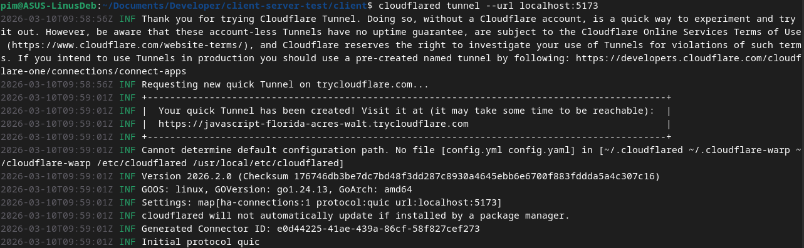
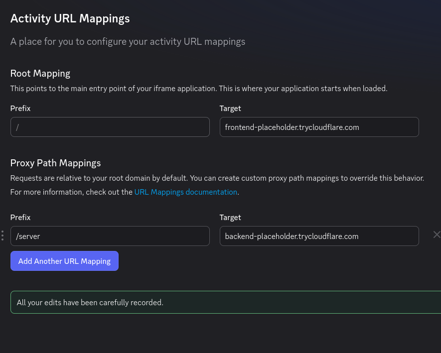

# Integrating Discord activities

The application is designed in such a way that it can easily be launched as a Discord activity. In order to set this up, two public URLs are required, one for the frontend and one for the backend. It's possible to set these up for free using [Cloudflare tunnels](https://blog.cloudflare.com/a-free-argo-tunnel-for-your-next-project/). If you already have two URLs, you can immediately skip ahead to the [Setting up Discord](#setting-up-discord) section.

## Generating public URLS using Cloudflare

It's possible to generate public URLs without having to own domains using Cloudflare tunnels. To create such a URL, install the [cloudflared](https://developers.cloudflare.com/cloudflare-one/networks/connectors/cloudflare-tunnel/) tool. For both the frontend and backend local hosts, use the following commands to open tunnels to Cloudflare and generate the URLs, each in a separate terminal.

```bash
cloudflared tunnel --url localhost:5000  # for the backend
cloudflared tunnel --url localhost:5173  # for the frontend
```

The output of such a command can look as follows:



In this image, the generated URL can be found in the box, in this case pointing to https://javascript-florida-acres-walt.trycloudflare.com, though yours will most likely look different.

> ⚠️ If you use a public URL, make sure to update your .env file so that the `VITE_SERVER_URL` navigates to the generated backend URL, and not to the localhost!

## Setting up Discord

Now that we have two urls, we can integrate a Discord activity. Throughout this section, these URLs will be https://frontend-placeholder.trycloudflare.com and https://backend-placeholder.trycloudflare.com for the frontend and backend respectively.

In the [Discord Developer Portal](https://discord.com/developers/applications), you first have [to create your app](https://docs.discord.com/developers/quick-start/getting-started#step-1-creating-an-app). Once that application is created, navigate to it and follow `Activities > URL Mappings > Activity URL Mappings` in the sidebar.For the root `/` prefix, fill in the URL of the frontend, without the `https://` prefix. Then create a new proxy path named `/server` and do the same for the backend URL. An example is shown below.



You can now invite your application to your server, where you play with Demiplane as you see fit! The Discord activity will communicate with the same server as the browser clients will, meaning that both will see the same content.
